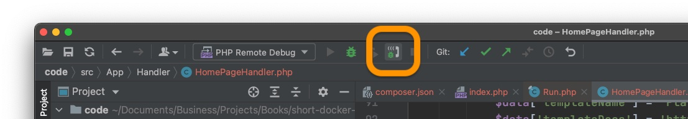
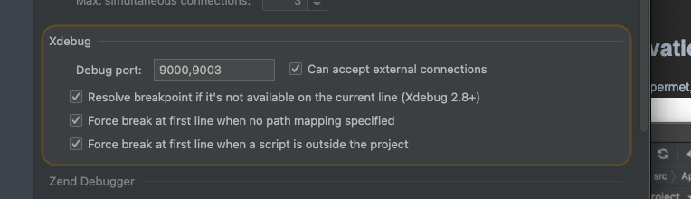
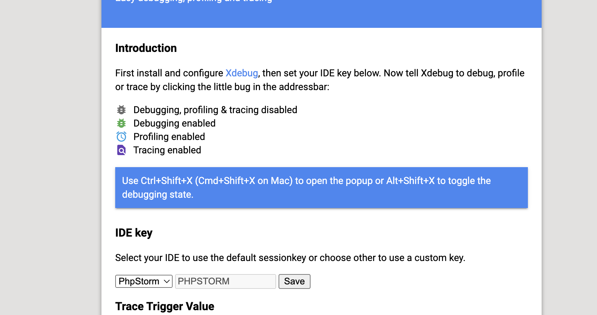

# 1 : Installation sur le systeme

XDebug est une extension de PHP, qui permet le débogage de scripts.

Pour installer xdebug, sur mac ou sur linux, il suffit que l'extension Xdebug soit chargée.
Quand vous faites un `php -v vous pouvez voir si XDebug est activé.


Pour l'installer vous pouvez suivre l'installation par OS : https://xdebug.org/docs/install
Ou sinon suivre le wizard (https://xdebug.org/wizard) pour réaliser une installation a la main.

L'installation automatique va surement vous rajouter une ligne dans la config de php (fichier php.ini) dont vous pouvez
aller checker l'emplacement grâce à un `php --ini`.
À vous de déplacer cette ligne dans un fichier tel que `ext-xdebug.ini` pour que ça soit plus propre.
Pourquoi ça ? Parce que les extensions de base et même php lui meme séparent souvent la config des extensions dans des fichiers
dédiés.
Il faudra aller les mettre dans un dossier `conf.d` dans le repertoire de php comme ceci : `/usr/local/etc/php/7.3/conf.d/ext-xdebug.ini`

Bon, une fois cela fait, vous devriez voir xdebug quand vous faites un `php -v` , sinon, revérifier les étapes précédentes.

# 2 : Configuration de base :

Je vous invite à utiliser cette config de base (à mettre dans le fichier de config spécifique a Xdebug) :

```
zend_extension = xdebug
xdebug.mode=debug
xdebug.client_port=9003
xdebug.start_with_request=yes
xdebug.idekey=PHPSTORM
```

# 3 : Activation automatique

Si vous avez déjà utilisé Xdebug vous savez surement qu'elle ralentit énormément de temps d'exécution des scripts.
C'est pourquoi il est nécessaire de pouvoir activer/désactiver l'extension à la demande pour l'utiliser uniquement au moment utile.
Par exemple ne le lancez surtout pas durant la génération du cache, pendant un `composer install`...


Là, il existe 2 solutions:

 
## Désactivation par la config de php

Avec cette méthode, en soi , comme pour toute extension, il suffit de commenter la fameuse ligne : `;zend_extension = xdebug`

Pour ça, utiliser un éditeur de texte, ou plutôt un script:

Voici un exemple, à adapter selon votre OS ( surtout le sed et le dossier de php)
### Version Mac
```
function changexdebugscript() {

alias xdebug=changexdebugscript

  cat << "EOF"
                           _      _
                          | |    | |
                  __  ____| | ___| |__  _   _  __ _
                  \ \/ / _` |/ _ \ '_ \| | | |/ _` |
                   >  < (_| |  __/ |_) | |_| | (_| |
                  /_/\_\__,_|\___|_.__/ \__,_|\__, |
                                               __/ |
                                              |___/
EOF
    php=$(php -v | tail -r | tail -n 1 | cut -d " " -f 2 | cut -c 1-3)
    if grep -R ";\+zend_extension" /usr/local/etc/php/"$php"/conf.d/ext-xdebug.ini
        then
            echo "Activation de xDebug pour PHP "$php
            sed -i -e "s/;zend_extension/zend_extension/g" /usr/local/etc/php/"$php"/conf.d/ext-xdebug.ini
        else
            echo "Désactivation de xDebug pour PHP "$php
            sed -i -e "s/zend_extension/;zend_extension/g" /usr/local/etc/php/"$php"/conf.d/ext-xdebug.ini
    fi
}
```

### Version Linux
```
function changexdebugscript() {

alias xdebug=changexdebugscript

cat << "EOF"
                           _      _
                          | |    | |
                  __  ____| | ___| |__  _   _  __ _
                  \ \/ / _` |/ _ \ '_ \| | | |/ _` |
                   >  < (_| |  __/ |_) | |_| | (_| |
                  /_/\_\__,_|\___|_.__/ \__,_|\__, |
                                               __/ |
                                              |___/
EOF
   php=$(php -v | tail -n 5 | cut -d " " -f 2 | cut -c 1-3 | head -n 1)
    if grep -R ";\+zend_extension" /etc/php/"$php"/cli/conf.d/20-xdebug.ini
        then
            echo "Activation de xDebug pour PHP "$php
            sed  -e "s/;zend_extension/zend_extension/g" /etc/php/"$php"/cli/conf.d/20-xdebug.ini | sudo tee  /etc/php/"$php"/cli/conf.d/20-xdebug.ini
        else
            echo "Désactivation de xDebug pour PHP "$php
            sed  -e "s/zend_extension/;zend_extension/g" /etc/php/"$php"/cli/conf.d/20-xdebug.ini | sudo tee  /etc/php/"$php"/cli/conf.d/20-xdebug.ini
    fi
}
```

De cette manière, peu importe la version de php en cours, la commande xdebug vas s'occuper de désactiver/ activer xdebug

## Désactivation par l'IDE

Si votre IDE, le permet, vous pouvez désactiver le fait qu'il écoute sur le port de xdebug à la volée :


Normalement, vous étes censés obtenir des perfs normales si vous désactivez xdebug de cette façon, mais de ma propre expérience.
Il arrive que sur de très gros script, xdebug ralentisse quand même PHP. À vous d'utiliser la méthode que vous préférez.


# Utilisation


Et bien là ça dépend de votre IDE, avec Phpstorm vous devez configurer le port dans la config 'Xdebug' dans les paramètres.
Puis lancer le script, page web, ou utilisez les `run configurations`.

https://www.jetbrains.com/help/phpstorm/debugging-with-phpstorm-ultimate-guide.html#debugging-a-php-cli-script


## Avec un navigateur web
Si vous vous débugger du code dans le navigateur, installer l'extension Xdebug helper puis configurer la avec votre IDEKEY :


# FAQ :

- Q : J'ai désactivé xdebug mais mon appli est tres lente
- R : Il faut redémarrer le serveur pour que PHP prenne en compte le changement de config.


- Q : Je ne sais pas ou est situé la config php pour mettre Xdebug
- R : Utilisez la commande php --ini pour localiser la config ou utilisez l'outil en ligne (https://xdebug.org/wizard)


- Q : Mon IDE ne s'arrête pas sur les points d'arret.
- R : Vérifier la config de php, vérifier le port utilisé par l'ide ( le meme que la config).Aussi que votre IDE écoute Xdebug.
Vérifiez aussi le comportement le fonctionnement en CLI ou en WEB.

