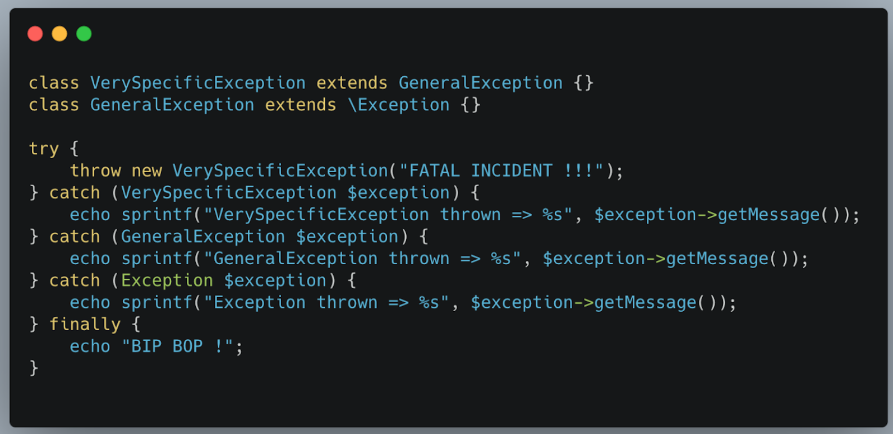
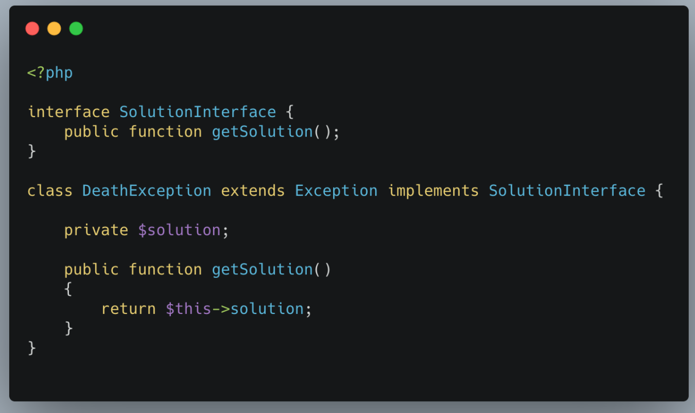

### Qu'est qu'une exception

- Objet lancé lors d'une erreur (probléme physique, erreur de programmation)
- Permet de revenir à un état stable
- Remonte la pile d'exécution les plus rapidement possible jusqu'à ce qu'elle soit rattrapé (gérer)
- Implémente l'interface `Throwable` qui permet de "catcher" une erreur
- A ne pas confondre avec Error (souvant lancé par PHP lui-même)

### Information d'une exception

````
public function __construct($message=""; $code=0, Throwable $previous=null) { }
````

4 éléments importants :
- Message
- Fichier source de l'exception
- Code d'exception
- Stack trace

### 4 outils

- Throw
- Try
- Catch
- Finally


> Que ce passe t'il si on ne catch pas l'exception ?
> Erreur fatale : le processus s'arrête


### Liste des exceptions PHP

- Exceptions SPL (PHP) : https://www.php.net/manual/fr/spl.exceptions.php
- Exceptions Réservées (Zend) : https://www.php.net/manual/fr/reserved.exceptions.php

### exception Handler

````
function handler($exception) {
    echo "<b>Exception:</b> ", $exception->getMessage();
    // logging ...
}

set_exception_handler("handler");

throw new Exception("Uncaught exception occurred!";

echo "Ah bah non...";
````

# Bonnes pratiques

- Gérer les exceptions de la plus spécifique à la moins spécifique



- Gérer plusieurs exceptions à la fois 

````
class MainException extends Exception {}
class SubException extends Exception {}
try {
    throw new SubException;
} catch (MainException | SubException $e) {
    echo "Exception thrown: " . get_class($e);
}
````

- Finally...

````
function getNumber(): int {
    try {
        echo "Hello";
        throw new RuntimeException( "Please help me");
        return 0;
    } catch(RuntimeException $exception) {
        echo "Il faut gérer cette exception"
        return -1;
    } finally {
        echo "My name is Julien"
        return 2;
    }
}
````


# Nommage

Nommer l'exception, pas l'émetteur

### Bien nommer les exceptions

**Mauvaise pratique**
 

**Bonne pratique**
  


### Contenu de l'exception 

Toujours fournir un maximum d'information pour le contexte


Ca évite de chercher pendant 4 heures pourquoi ça bug...

### Utiliser le I de SOLID



Ne pas hésiter à utiliser des interfaces

### Gérer l'exception au bon moment


Si vous ne savez pas comment gérer l'exception, laissez la remonter. C'est surement du ressort des classes au dessus.

https://github.com/symfony/symfony/blob/4.3/src/Symfony/Component/HttpKernel/EventListener/ExceptionListener.php

# Conclusion

Une exception est un événement qui arrive à un moment dans l'application.

Cet événement intervient lorsque quelque chose de problématique est intervenue.La cause peut être trés varié.

L'exception doit être la plus explicite possible.

Gérer toutes les exceptions dans un try / catch (Exception $e) est une très mauvaise pratique.


### Sources :

- https://www.php.net/
- http://www.upv.es/~jgonsol/tutorial/java/exceptions/definition.html#:~:text=Definition%3A%20An%20exception%20is%20an,the%20normal%20flow%20of%20instructions.
- https://medium.com/@anastasionico/good-practices-handling-error-and-exceptions-in-php-5c3d84d342a9
- https://stackify.com/php-try-catch-php-exception-tutorial/
- https://stackoverflow.com/ ( ne jugez pas svp)
- https://blog.theodo.com/2014/04/manage-php-errors-and-exceptions-in-your-project/#:~:text=Errors%20or%20Exceptions,tell%20that%20something%20went%20wrong.&text=Exceptions%20are%20catchable%2C%20unlike%20errors,the%20execution%20of%20the%20program.
- https://blog.eleven-labs.com/en/php_handle-exception-gracefully/


