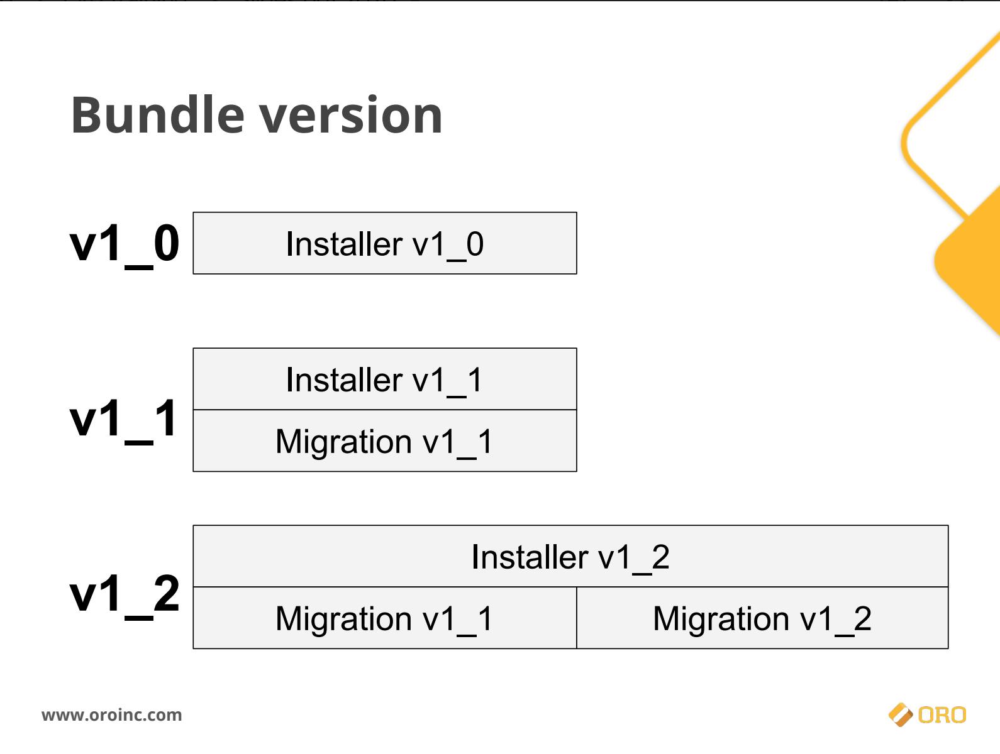

Il y a 2 types de migrations dans Oro :
1. Migrations Schema
2. Migrations Data

Doc. Oro : https://github.com/oroinc/platform/tree/master/src/Oro/Bundle/MigrationBundle

Nous vous conseillons de suivre le cours "Entities and their data" d'OroInc qui vous apprendra en détails les méthodes et bonnes pratiques pour faire eds migrations dans OroPlatform :
https://oroinc.com/oro-fundamentals-online-course/

> Extrait :
> 

## 1. Migrations Schema

Modification de schéma Doctrine => DBAL

- Pas d'utilisation d'entité/ORM dans le schéma

#### 1.1. implémentation de l'interface `Installation`

utilise des numéros de versions (=> `getVersion()`)

/!\ regroupement de l'ensemble des migrations pour créer le schéma

=> cf Schéma de Yevhen

#### 1.2. implémentation de l'interface `Migration`

/!\ quand on ajoute une Migration, il faut systématiquement :
- ajouter la migration dans l'installation en adaptant le schéma désiré
- changer le numéro de version

#### 1.3. Cas spécifiques : champs non null
 
utilisation des "OrderedMigration" => `getOrder():int`

Ex : ajout champ UNIQUE + NOT NULL
> migration A avec `up()` methode `alterTable()` avec ajout de la colonne déclarée en `NULL` => ajout addPostQuery()
> migration B avec `up()` methode `alterTable()` avec ajout de la colonne `NOTNULL`

#### 1.4. Cas spécifiques : modification de colonne existante

utilisation de requêtes .SQL avec la méthode  `addPostQuery()`

#### 1.5. Cas spécifiques : Oro options
 
Utilisation de "Oro_Options"

#### 1.6. Cas spécifiques : OroConfigField
 
OroConfigField uniquement pour les entités crées par ce bundle

#### 1.7. Cas spécifiques : entity extend

Implements : ExtendExtensionInterface

#### 1.8. Cas spécifiques : dépendance des migrations
 
utilisation des "DependentMigration"

## 2. Migrations Data

Migration pour créer de la donnée.

Exécuter après les migrations de schéma => ORM

Usage : initialiser une environnement avec des données

/!\ Si Schema est mis a jour, il faut impacter les migrations de data

## 3. Nomenclature des migrations

#### 3.1. Installer

Format : `{nom_du_bundle}Installer`

ex : KibokoBarcodeBundleInstaller

#### 3.2. Migration

Le nom de la migration doit correspondre au fonctionnel de la migration.
Si le domaine est différent, on créé des fichiers différents par domaine.

ex : AddBudgetMigration ou FixProductsNorms

## 4. Tests pour vérifier la migration

- `bin/console oro:platform:update --force`
- `bin/console oro:migration:load` (si fixture en plus de `main`)
- `bin/console oro:entity-extend:cache:clear` => si erreur, PR refusée

(prochainement ajouté à la CI)
