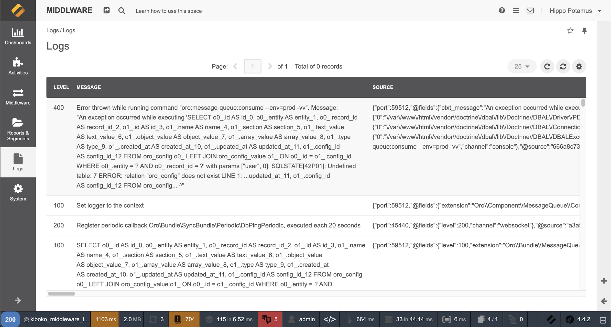
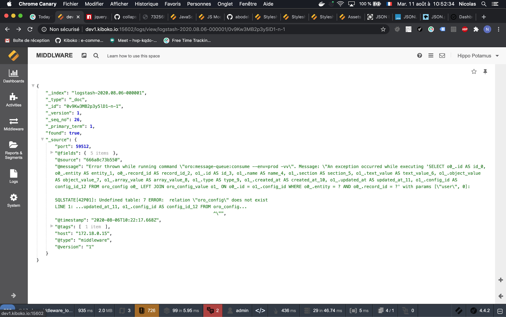

# PSR3 et Monolog

## Qu'est-ce qu'un log ? A quoi ça sert ?

- Log = Journal
- Indique différentes choses telles que des actions qui sont faites
- Très utiles pour les erreurs

## La PSR-3, une interface commune d'interopérabilité

https://www.php-fig.org/psr/psr-3/

- LoggerInterface
- Remplace les logs de PHP
- Propose différents niveaux de sévérité de la norme Syslog

| Debug | Info | Notice | Warning | Error | Critical | Alert | Emergency|
|---|:---:| :---:| :---:| :---:| :---:| :---:| :---:| 
| 100 | 200 | 250 | 300 | 400 | 500 | 550 | 600 |

- Implémentée par KLogger, Monolog, Analog et bien d'autres

## Comment choisir le bon niveau de log ?

- **Debug** : Informations pour debug son app 🐛
- **Info** : Différentes informations de ce qui se passe ✅
- **Notice** : D'autres informations qui peuvent être utiles qu'on peut garder 📖
- **Warning** : Il faut prêter attention mais ce ne sont pas des erreurs ⚠️
- **Error** : Quelque chose n'a pas fonctionné mais ça peut parfois attendre ❌
- **Critical** : Quelque chose n'a pas fonctionné mais là c'est urgent 💥
- **Alert** : Quelque chose n'est plus utilisable du tout 🚨
- **Emergency** : Système inutilisable ☢️

## Une implémentation de PSR-3 : Monolog

https://github.com/Seldaek/

- Permet d'envoyer des logs à plusieurs handlers
- Filtrer selon le niveau de log

Exemple de la doc Symfony :

## Utilisation concrète des journaux : Middleware et Kibana

Connecter Monolog à Elastic Stack (Middleware)

