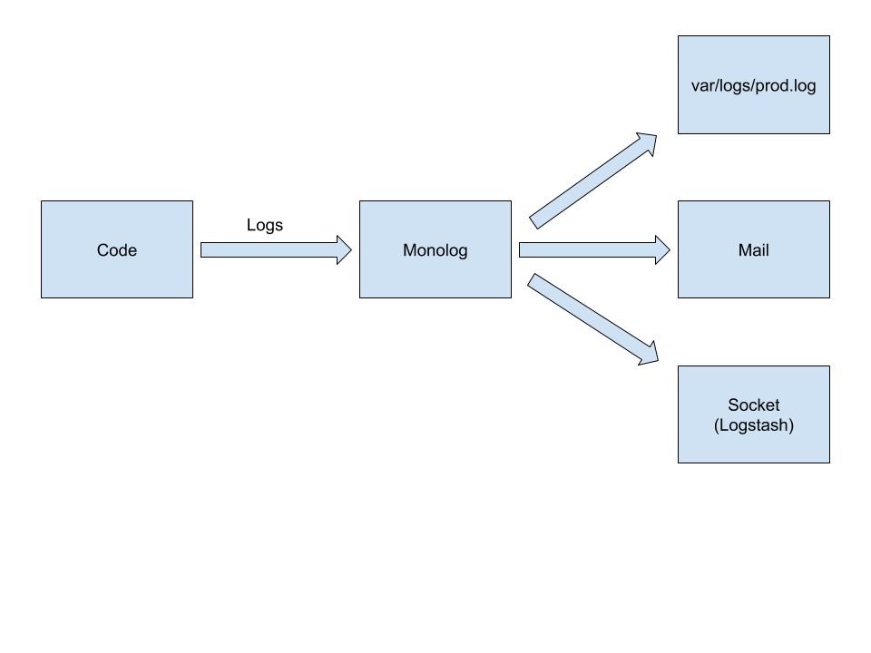
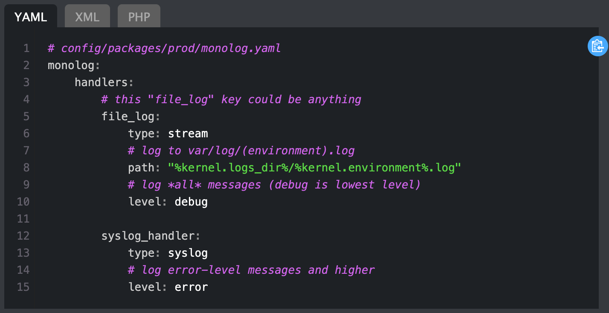
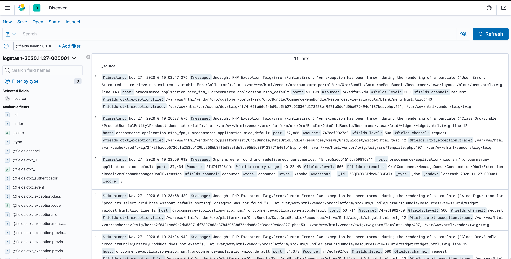

# PSR3 et Monolog

## Qu'est-ce qu'un log ? A quoi ça sert ?

- Log = Journal
- Indique différentes choses telles que des actions qui sont faites
- Très utiles pour les erreurs

## La PSR-3, une interface commune d'interopérabilité

https://www.php-fig.org/psr/psr-3/

- LoggerInterface
- Remplace les logs de PHP
- Propose différents niveaux de sévérité de la norme Syslog

| Debug | Info | Notice | Warning | Error | Critical | Alert | Emergency|
|---|:---:| :---:| :---:| :---:| :---:| :---:| :---:| 
| 100 | 200 | 250 | 300 | 400 | 500 | 550 | 600 |

- Implémentée par KLogger, Monolog, Analog et bien d'autres

## Comment choisir le bon niveau de log ?

**Niveau 1**
- **Debug** : Informations pour debug son app 🐛

> réservé au développeur

**Niveau 2 :**
- **Info** : Différentes informations de ce qui se passe ✅
- **Notice** : D'autres informations qui peuvent être utiles qu'on peut garder 📖
- **Warning** : Il faut prêter attention mais ce ne sont pas des erreurs ⚠️
- **Error** : Quelque chose n'a pas fonctionné mais ça peut parfois attendre ❌

> dysfonctionnement non bloquant (reprise sur erreur)

**Niveau 3 :**
- **Critical** : Quelque chose n'a pas fonctionné mais là c'est urgent 💥
- **Alert** : Quelque chose n'est plus utilisable du tout 🚨
- **Emergency** : Système inutilisable ☢️ (= réveil quelqu'un la nuit pour intervenir) [notif SMS possible]

> dysfonctionnement bloquant (pas de reprise sur erreur)


## Une implémentation de PSR-3 : Monolog

Monolog a été développé par Jordi Boggiano (co-fondateur de Composer) : https://github.com/Seldaek/

- Permet d'envoyer des logs à plusieurs handlers
- Filtrer selon le niveau de log



Exemple d'utilisation, pour des logs Critical/Alert/Emergency ils pourraient être envoyés par email (ou par SMS).

Exemple de la doc Symfony, avec configuration des logs de base :
 


Tous les logs seront donc écrit dans le fichier .log

## Cas concrets

Utilisation concrète 

- 1er étape : log envoyé a Elastic via Logstash
- 2ème étape : affichage des logs en BO gràce au composant ElasticSearch : https://github.com/elastic/elasticsearch-php 

Exemple de configuration avec répartition des logs dans 2 handlers :

````
services:
    monolog.formatters.logstash:
        class: Monolog\Formatter\LogstashFormatter
        arguments:
            $applicationName: 'kiboko'
monolog:
    handlers:
        mail_on_errors:
            type: fingers_crossed
            action_level: critical
            handler: buffered
        buffered:
            type: buffer
            handler: swift
        swift:
            type: swift_mailer
            from_email: alert@kiboko.fr
            to_email: nicolas@kiboko.fr
            subject: An Error Occurred!
            level: critical

        logstash:
            type: socket
            connection_string: 'tcp://logstash:5044'
            level: debug
            formatter: monolog.formatters.logstash
````

## Kibana

Kibana est une interface utilisateur gratuite et ouverte qui vous permet de visualiser vos données Elasticsearch et de naviguer dans la Suite Elastic. 

https://www.elastic.co/fr/kibana

Utilisation de la stack ElasticStack (ex: EKL Elastic/Kibana/Logstash)



Avec Kibana, on a la possiblité de filter les logs par niveau


## Conférences AFUP à ce sujet 

Pour en savoir plus vous pouvez retrouver

- État de l'art d'Elasticsearch avec PHP par Damien Alexandre

<iframe width="739" height="418" src="https://www.youtube.com/embed/783t6r0ejfs" frameborder="0" allow="accelerometer; autoplay; clipboard-write; encrypted-media; gyroscope; picture-in-picture" allowfullscreen></iframe>

=> ForumPhp 2020 : https://afup.org/talks/3449-etat-de-l-art-d-elasticsearch-avec-php

- Laisse pas trainer ton log par Olivier Dolbeau :

<iframe width="739" height="418" src="https://www.youtube.com/embed/1r1SOeaDqH4" frameborder="0" allow="accelerometer; autoplay; clipboard-write; encrypted-media; gyroscope; picture-in-picture" allowfullscreen></iframe>

=> ForumPhp 2014 : https://afup.org/talks/1160-laisse-pas-trainer-ton-log
