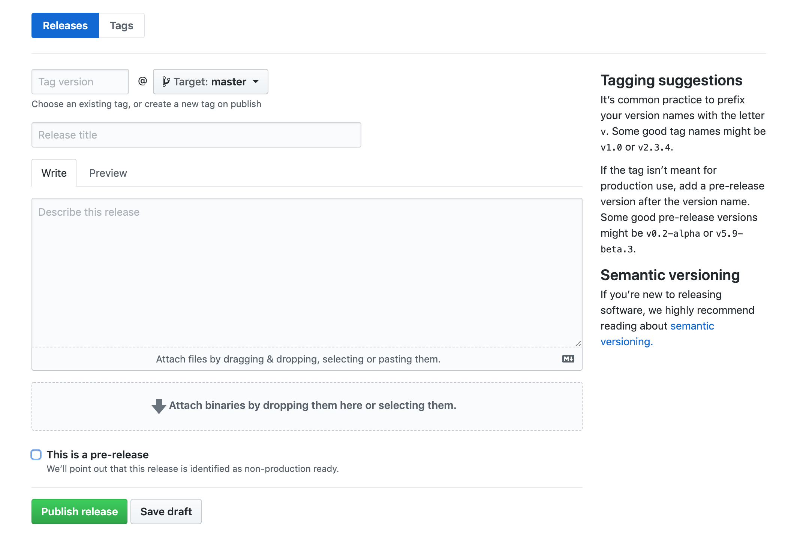
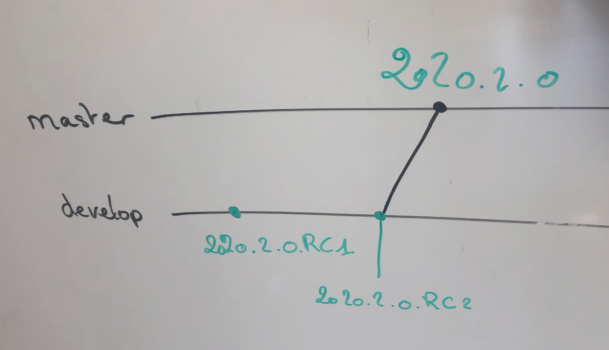

## 1. Vue Kanban

Dans cette vue Kanban d'un projet github, il y a :
- des tickets
- des PR
- des notes

## 2. Tickets

**2.1 Création**

Lors de la création d'un ticket :

- Choisir le projet correspondant
- Choisir le milestone
- Ajouter les labels/libellés

**2.2 Sous-tâches**

Penser à ajouter des sous-taches dans le ticket tel que 

`- [ ] Sous-tache` 

(barre d'avancement sur le ticket)

Si la sous tâche est importante possiblité de créer un nouveau ticket et de faire référence dans le ticket parent tel que :

`- [ ] Sous-tache #123`

**3.3 Commentaires**

Usage du développeur :
- remonter toutes les informations dans le tickets : bug, solution à un bug...
- identifier les utilisateurs github avec `@user`

## 3. Pull Request (PR)

Lors d'une nouvelle tache, on créé une nouvelle branche git
Dès le 1er commit push, on créé une nouvelle PR associé au projet et on ajoute le libellé `WIP`

Dès que la tache côté développeur est finie, on peut retirer le libellé `WIP` et renseigner un reviewer.

Les taches du release manager : 
- échanger dans la PR avec le développeur
- fusionner les PR
- tester `develop/staging/master` (vérifier que les fusions de branches fonctionnent normalement)
- livrer sur l'environnement correspondant en utilisant une release (version Github)

## 4. Releases

Création via l'UI de github (tag .git + commentaire)

Convention de nommage des tags : `vyyyy.mm.x` 

> Exemple :
>
> `v2020.02.1`
>
> si c'est la 1ère livraison du mois

**Pre-release**

Pour usage sur la branch `develop`

Convention de nommage des pre-release : `vyyyy.mm.xRCx` 

> Exemple :
>
> `v2020.02.1RC1`
>
> si c'est la 1ère livraison du mois

