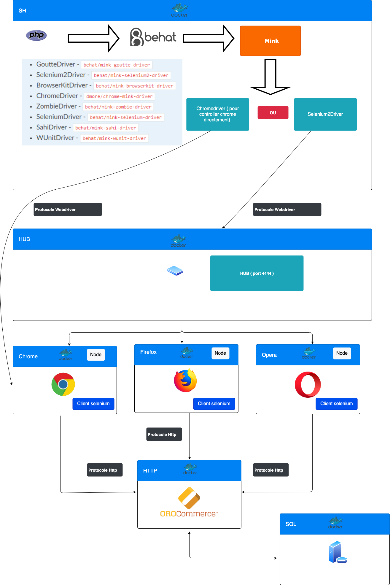

## Concepts

Les informations ci-dessous résume les concepts et les outils qui sont importants pour la compréhension et l’utilisation
de Behat et de l'extension Behat pour Oro : OroBehatExtension.

**Behavior-driven development (BDD)** est un processus de développement logiciel issu du développement axé sur les tests (TDD). 
Le BDD combine les techniques générales et les principes de TDD avec des idées de conception axée sur le domaine et
l'analyse d'objet et du design pour fournir aux équipes de développement et de gestion de logiciels des outils partagés et 
un processus partagé de collaboration pour le développement de logiciels.

  
Technos/classes utilisés

1. [Behat](https://docs.behat.org/en/v3.0/) est un framework de développement basé sur le comportement pour PHP. 
   Cet outil permet de décrire le comportement de l'application voulue en utilisant Php et
   le language de test : [Gherking](https://docs.behat.org/en/latest/user_guide/gherkin.html)
   Vous pouvez utiliser Behat pour décrire tout ce que vous pouvez décrire dans la logique métier. 
   Outils, applications GUI, applications Web, etc.

2. [Mink](http://mink.behat.org/en/latest/) est une extension de Behat qui vas permettre de controller 
   un navigateur durant les tests en utilisant PHP. Il controlle des emulateurs de navigateurs(voir plus bas),
   un des avantages d'utiliser Mink c'est qu'il supprime les différences entres les différents emulateurs
   de navigateur et leurs drivers.

3. [WebDriver](https://www.w3.org/TR/webdriver/) est un protocole qui permet de controller des navigateurs en JSON. 
   Chaque navigateur est appuyé par une implémentation spécifique de WebDriver, appelée un driver

4. [Les drivers Mink](https://mink.behat.org/en/latest/guides/drivers.html) ce sont des plugin de mink qui 
   permettent de controller des 'controlleurs/émulateurs' de navigateurs tel que le très connu Selenium2. 
   Dans oro, on utilise Chromedriver.

5. [ChromeDriver](https://sites.google.com/a/chromium.org/chromedriver/) est un driver de Mink comme Selenium2Driver mais ne 
   fonctionne que pour chrome et a la particularité de fonctionner sans Selenium ce qui rend les tests plus rapides sur chrome.

6. [Selenium](https://www.selenium.dev/) est un framework de test informatique développé en Java qui est composé de 3 grandes briques :
    - Selenium WebDriver : Framework de test fonctionnel permettant l’écriture de scripts de test automatisés
      en different languages. Il met à disposition une API pour controller tous les navigateurs.
    - Selenium IDE : qui permet de créer des script , sous forme d'extension chrome our firefox, pour controller des navigateurs.
    - Selenium Grid : Qui se compose d'un hub et de nodes, permet de lancer des test sur plusieurs navigateurs en même temps.

7. [Symfony2Extension](https://github.com/Behat/Symfony2Extension/blob/master/doc/index.rst) qui ajoute une intégration pour Symfony avec Behat.

8. [OroTestFrameworkExtension](https://github.com/oroinc/platform/blob/master/src/Oro/Bundle/TestFrameworkBundle/Behat/ServiceContainer/OroTestFrameworkExtension.php)
      est une extension de Symfony pour intégrer Behat dans Oro, il ajoute des features tel que :
    - l'autoloading des contextes, permet de construire des suites de tests spécifiques.
    - la possibilité de déclarer des 'Elements' facilement dans le fichier de config behat.yml
    - Mapper facilement des champs de formulaires
    
9. [OroElementFactory](https://github.com/oroinc/platform/blob/master/src/Oro/Bundle/TestFrameworkBundle/Behat/Element/OroElementFactory.php)
   est une classe qui permet de manipuler des éléments du DOM : 
    -  ``hasElement($name)``
    - ``createElement($name, NodeElement $context = null)``
    - ``guessElement($name)``
    - ``findElementContains($name, $text, Element $context = null)``
    - ``findElementContainsByCss($name, $text, Element $context = null)``
    - ``findElementContainsByXPath($name, $text, $useChildren = true, Element $context = null)``
    - ``findAllElements($name, NodeElement $context = null)``
    - ``getPage()``
    - ``findElement($name, $selectorCallback, Element $context = null)``
    - et d'autre fonctions ....

## Architecture

## Doc à lire dans l'ordre

- 1: [Installation/Lancer les tests](behat-configuration)
- 2: [Les services Symfony dans les tests behat](behat-symfony)
- 3: [C'est quoi un context](behat-contextes)
- 4: [L'autoloading des tests behat](behat-autoloading)
- 5: [L'isolation de l'état de l'application entre les tests](behat-isolation)
- 6: [Un Exemple pour mieux comprendre](behat-exemples)
- 7: [Conventions d'écriture des test](behat-conventions)
- 8: [Elements et formulaires](behat-elements-form)
- 9: [Charger des données avec les fixtures](behat-fixtures)
- 10: [Tips and tricks](behat-tips)

## Docs relatives (externes)

 - [Behat](https://docs.behat.org/en/latest/guides.html)
 - [Gherkin](https://cucumber.io/docs/gherkin/)
 - [Mink](http://mink.behat.org/en/latest/)
 - [WebDriver](https://www.w3.org/TR/webdriver/)
 - [MinkSelenium2Driver](https://github.com/minkphp/MinkSelenium2Driver)
 - [ChromeDriver](https://sites.google.com/a/chromium.org/chromedriver/)
 - [Selenium](https://www.selenium.dev/)
 - [Symfony2Extension](https://github.com/Behat/Symfony2Extension/blob/master/doc/index.rst)
